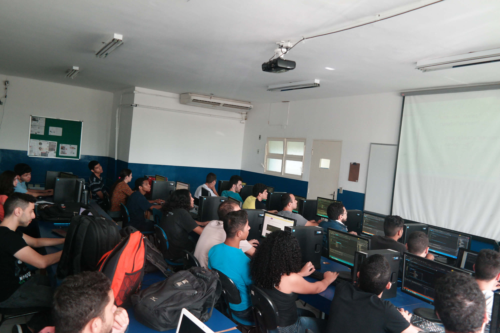
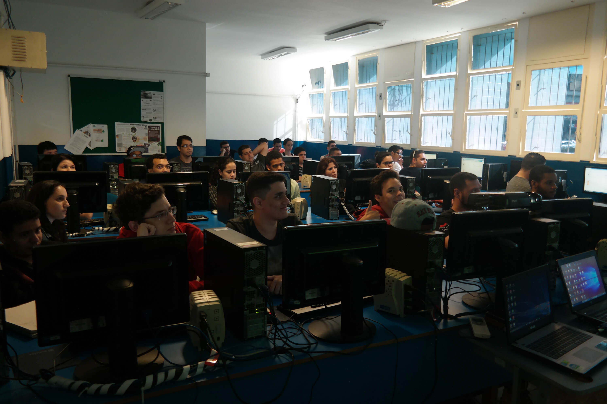
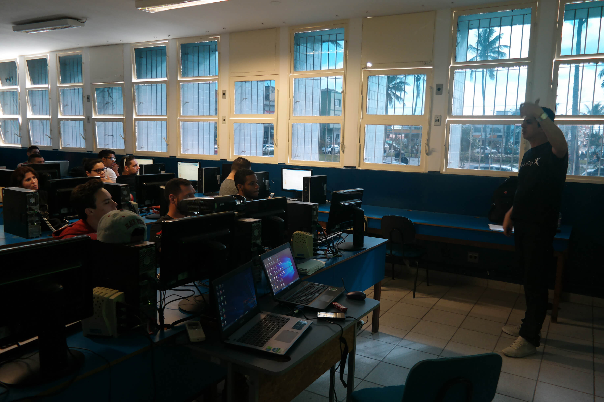
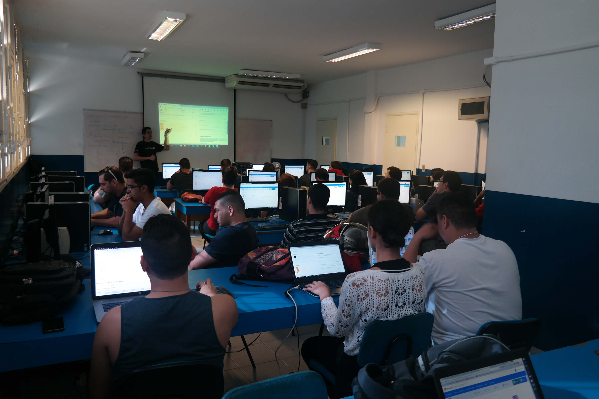
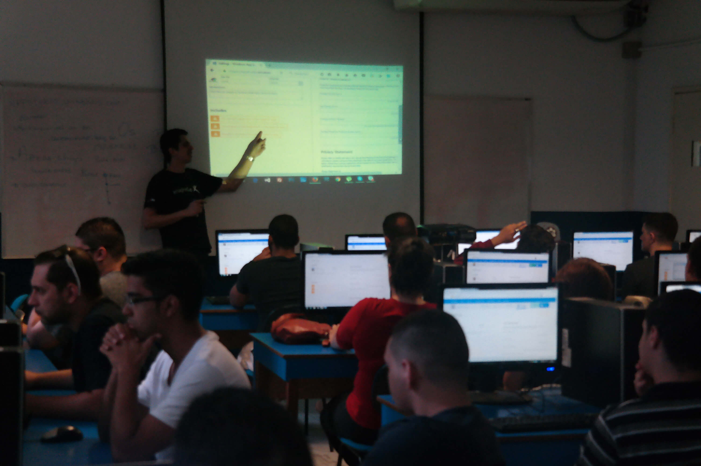

# 💻 Mini Curso: Desenvolvimento de Web Apps
📍 *Fatec Praia Grande – 05 de Setembro de 2016*

Este repositório documenta uma das experiências mais marcantes da minha jornada como palestrante e entusiasta da inovação tecnológica. Organizado na Fatec Praia Grande, o minicurso teve como foco o desenvolvimento de Web Apps — aplicações modernas, acessíveis e que rodam diretamente no navegador.

---

## ✨ O que são Web Apps?

Web Apps são aplicações que funcionam diretamente em navegadores web, sem necessidade de instalação. Podem ser acessadas de qualquer lugar, em qualquer dispositivo, bastando apenas uma conexão à internet. Seu funcionamento é semelhante ao de aplicativos nativos, com a vantagem de não ocuparem espaço no dispositivo do usuário.

---

## 🚀 Vantagens dos Web Apps

- **Acessibilidade multiplataforma** (desktop, tablet, smartphone)
- **Atualizações centralizadas**, sem depender do usuário
- **Menor custo de desenvolvimento e manutenção**
- **Alta escalabilidade**
- **Integração com tecnologias modernas (APIs, serviços em nuvem, etc.)**

---

## 🧠 Tecnologias Abordadas

Durante o minicurso, abordamos:

- HTML5, CSS3 e JavaScript
- Conceitos de responsividade e design mobile-first
- Noções de Progressive Web Apps (PWA)
- Introdução ao uso de frameworks leves e APIs RESTful

---

## 🎤 Experiência como Palestrante

Este evento foi mais do que compartilhar conhecimento — foi sobre fomentar inovação, abrir portas e mostrar aos alunos que é possível construir soluções relevantes com as ferramentas que temos hoje. Como palestrante, sempre busquei alinhar **prática, clareza didática e incentivo ao empreendedorismo** no uso da tecnologia.

---

## 🖼️ Galeria de Imagens

Substitua as imagens abaixo após o upload na pasta do projeto:

---

## 🤝 Agradecimentos

Gratidão à Fatec Praia Grande e aos participantes por fazerem parte dessa jornada de aprendizado e inspiração.

